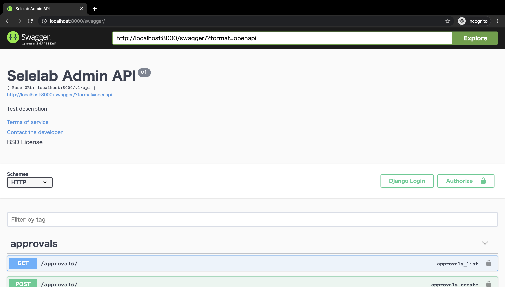

# エレラボ管理画面API

## 環境構築
### API系
- データベース系のセットアップ
  - こちらの手順通りDocker上でデータベース系を構築してください。
    - https://github.com/Tsutomu-Ikeda/docker-database
  - admin-api用のデータベースを用意します。
    ```bash
    mysql --host=127.0.0.1 -u root -p
    Enter password: (パスワードを入力:初期設定は"mysql")
    mysql> create database `selelab-admin-api`
    mysql> grant all privileges on `selelab-admin-api`.* to `user`@`%`;
    ```

- 環境変数の設定
  - `.env` ファイルを `docker-compose.yml` と同じ階層に配置します。
    ```
    $ tree . -a -L 1
        .
        ├── .env
        ├── .git
        ├── .gitignore
        ├── .vscode
        ├── LICENSE
        ├── README.md
        ├── doc_images
        ├── docker-compose.yml
        ├── docs
        ├── setup.cfg
        ├── spec.md
        └── web
    ```
    .envの内容は以下の通りです。
    ```conf
    DJANGO_SECRET_KEY=selelab*****admin-api

    # mysql://db:3306/selelab-admin-api
    DB_NAME=selelab-admin-api
    DB_USER=user
    DB_PASS=pass
    DB_HOST=db
    DB_PORT=3306

    # redis
    REDIS_HOST=redis
    REDIS_PORT=6379
    REDIS_DB=0
    REDIS_PASS=
    ```
    `DJANGO_SECRET_KEY` は https://djecrety.ir/ これを使って乱数を生成した後、`*****` の部分を置き換えてください。

- 起動
  - docker-composeさえ使えばあとはもう簡単です。
    ```bash
    docker-compose up -d --build
    ```
  - なお、このままだとユーザーが作られておらず、何もできないので以下のようにseedを走らせてください。
    ```bash
    docker-compose run --entrypoint '' python pipenv run python manage.py loaddata seed_auth.json seed_accounting.json
    ```

- ブラウザで http://localhost:8000 にアクセスすると以下のように Swagger が表示されます。
    

- エンドポイントにアクセス
    - ユーザーの一覧を取得する
    http://localhost:8000/v1/api/users/
        ```json
        [
            {
                "id": "380ac58d-1595-4614-a8e2-5e881b51d18a",
                "name": "user1",
                "email": "user1@example.com",
                "last_modified": "2020-02-08T01:41:57.829000Z",
                "icon_media_key": "8284e730-8e31-47b6-b4ab-f230e12ee089",
                "date_registered": "2020-02-08T03:02:10.908000Z"
            },
            {
                "id": "f2b34d83-b890-45ff-aedd-1d11a92cb9f5",
                "name": "user2__",
                "email": "user2@example.com",
                "last_modified": "2020-02-08T03:00:46.763000Z",
                "icon_media_key": "8284e730-8e31-47b6-b4ab-f230e12ee089",
                "date_registered": "2020-02-08T03:02:10.908000Z"
            }
        ]
        ```
    - プロジェクトの一覧を取得する
    http://localhost:8000/v1/api/projects/
        ```json
        [
            {
                "id": "1982e609-9c92-40ab-ac85-ee7f2830ab2a",
                "title": "すごいプロジェクト",
                "accounting_type": "soft",
                "leader": "380ac58d-1595-4614-a8e2-5e881b51d18a",
                "closed": false
            },
            {
                "id": "5cfec77f-c466-415b-a7de-8be6b43bbc6d",
                "title": "DjangoでREST API作るぞ",
                "accounting_type": "soft",
                "leader": "f2b34d83-b890-45ff-aedd-1d11a92cb9f5",
                "closed": false
            },
            {
                "id": "66c1b2b1-7376-48c1-9509-e52d568ed910",
                "title": "ホゲホゲプロジェクト",
                "accounting_type": "soft",
                "leader": null,
                "closed": false
            },
            {
                "id": "da96e698-3dae-47b5-ae64-b6f5a7650387",
                "title": "ホゲホゲプロジェクト",
                "accounting_type": "soft",
                "leader": "380ac58d-1595-4614-a8e2-5e881b51d18a",
                "closed": false
            }
        ]
        ```
    - 購入の一覧を取得する
    http://localhost:8000/v1/api/purchases/
        ```json
        [
            {
                "id": "690c4aeb-fef7-45d2-a98b-1c5f8c7af548",
                "title": "交通費",
                "description": "東京駅から草津温泉までの交通費です。",
                "project_id": "1982e609-9c92-40ab-ac85-ee7f2830ab2a",
                "evidence_media_key": "d2a85f4f-4ac5-4dcb-986e-6e988d83d3b4",
                "price": 5670,
                "returned": false,
                "approved": false
            },
            {
                "id": "768a00ae-b643-4449-8148-418e996636c7",
                "title": "交際費",
                "description": "軽井沢ビール購入代金",
                "project_id": "1982e609-9c92-40ab-ac85-ee7f2830ab2a",
                "evidence_media_key": "d2a85f4f-4ac5-4dcb-986e-6e988d83d3b4",
                "price": 1862,
                "returned": false,
                "approved": false
            }
        ]
        ```

<!--
### ドキュメント系

- 初期設定

    ```
    # nodejsをインストールする
    brew install node

    # aglioをインストールする
    npm install -g aglio
    ```

- http://localhost:3000/ でAPIドキュメントをみるためのサーバーを起動する
    ```
    aglio -i spec.md -s
    ```

- spec.htmlを出力する

    GitHub上にアップロードした後、https://htmlpreview.github.io/?https://github.com/selelab/admin-api/blob/master/docs/spec.html で見ることができる。
    ```
    aglio -i spec.md -o docs/spec.html
    ```
-->
